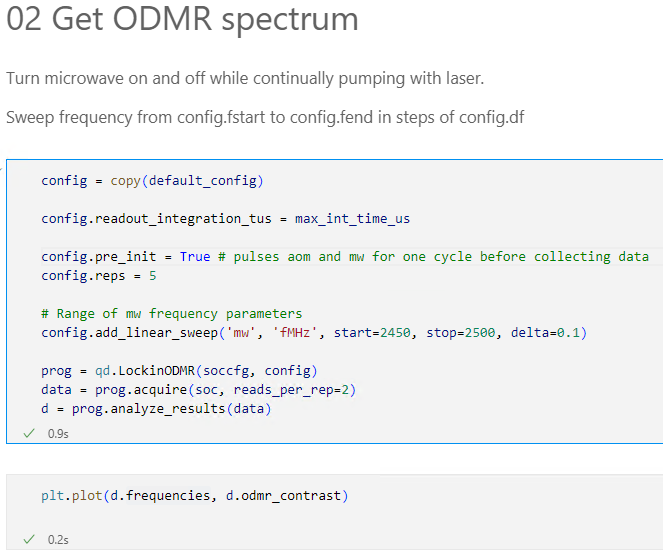

# QICK-DAWG

## Quantum Instrumentation Control Kit -  Defect Arbitrary Waveform Generator 

    

## Description
The Quantum Instrumentation Control Kit - Defect Arbitrary Waveform Generator (QICK-DAWG) is an extension of [QICK](https://github.com/openquantumhardware/qick) with the purpose of controlling nitrogen-vacancy in diamond and other quantum defects for quantum sensing and other quantum applications.  QICK-DAWG utilizes Xilinx Radio Frequency System-on-Chip (RFSoC) Field Programmable Gate Array (FPGAs) evaluation boards which are significantly less expensive than hardware currently available and have the potential for superior capabilities.

In this package we supply specific mw, laser, and readout pulsing code to characterize  photoluminescence intensity, optically detected magnetic resonance (ODMR), spin readout, Rabi Oscillation, Hahn Echo T2, and T1 relaxation. A Jupyter Notebook Demo is included for performing all of these measurements with an RFSoC4x2 to demonstrate typical measurements. 

## Hardware

- Either [RFSoC4x2](https://www.xilinx.com/support/university/xup-boards/RFSoC4x2.html)  or [ZCU111](https://www.xilinx.com/products/boards-and-kits/zcu111.html)
- Router [(example)](https://www.amazon.com/TP-Link-Integrated-Lightening-Protection-TL-R605/dp/B08QTXNWZ1/ref=asc_df_B08QTXNWZ1/?tag=hyprod-20&linkCode=df0&hvadid=475692076734&hvpos=&hvnetw=g&hvrand=3761702075041011209&hvpone=&hvptwo=&hvqmt=&hvdev=c&hvdvcmdl=&hvlocint=&hvlocphy=1022494&hvtargid=pla-1149738264234&psc=1) and ethernet cords
- Control Computer 
- Low Frequency Differential Amplifier such as  [Texas Instruments LMH5401EVM](https://www.digikey.com/en/products/detail/texas-instruments/LMH5401EVM/5031896?s=N4IgTCBcDaIDIFkASBWALABgIwFEBqCIAugL5A)
- 3 Voltage supplies to power the differential amplifier

## Installation
To install QICKDAWG software follow the README found [here](https://gitlab-ex.sandia.gov/amounce/qickdawg/-/blob/main/installation/RFSoC4x2_ReadMe.md#quantum-instrumentation-control-kit-defect-arbitary-waveform-generator). Software installation includes:

## Usage
QICKDAWG has programs for the characterization of:
- Photoluminescence (PL) Intensity
- Optically Detected Magnetic Resonance (ODMR)
- Readout Window
- Rabi Oscillations 
- Hanhn Echo T2
- T1 Relaxation

using a ZCU111 or RFSoC4x2. Support for the ZCU216 coming soon. 

<!-- ### Example use: ###

Optically Detected Magnetic Resonance (ODMR) is one of the QICKDAWG demo pulse sequences. To run ODMR, and any of the other pulse sequences, you must first set the default configuration. The following code, found in the demo Jupyter Notebook, sets the deault configuration.

    

The following code copies the default configuration, adjusts a a few configuration settings, and runs ODMR. This code is found in the demo Jupyter Notebook. 

    

The pulse sequencing for ODMR is configured in LockinODMR.py as: 

    

This is a graph of microwave frequency (MHz) versus ODMR contrast made from data collected using the QICKDAWG ODMR pulse sequencing.

    

 -->

## Support
To raise an issue use the Issues button on the side bar. Email Andy Mounce at amounce@sandia.gov for further support. 

## Authors and acknowledgment
Andy Mounce[1](#CINT), Emmeline Riendeau[1](#CINT),[2](#Hav) 

<a name="CINT">1</a>: Center for Integrated Nanotechnology (CINT), Sandia National Laboratories 
<a name="Hav">2</a>: Haverford College '24

Thank you to Sho Uemura at Fermi Labs for helping us edit the QICK firmware. 

## License
Copyright 2023 National Technology & Engineering Solutions of Sandia, LLC (NTESS). Under the terms of Contract DE-NA0003525 with NTESS, the U.S. Government retains certain rights in this software.

Permission is hereby granted, free of charge, to any person obtaining a copy
of this software and associated documentation files (the "Software"), to deal
in the Software without restriction, including without limitation the rights
to use, copy, modify, merge, publish, distribute, sublicense, and/or sell
copies of the Software, and to permit persons to whom the Software is
furnished to do so, subject to the following conditions:

The above copyright notice and this permission notice shall be included in all
copies or substantial portions of the Software.

THE SOFTWARE IS PROVIDED "AS IS", WITHOUT WARRANTY OF ANY KIND,
EXPRESS OR IMPLIED, INCLUDING BUT NOT LIMITED TO THE WARRANTIES OF
MERCHANTABILITY, FITNESS FOR A PARTICULAR PURPOSE AND NONINFRINGEMENT.
IN NO EVENT SHALL THE AUTHORS OR COPYRIGHT HOLDERS BE LIABLE FOR ANY CLAIM,
DAMAGES OR OTHER LIABILITY, WHETHER IN AN ACTION OF CONTRACT, TORT OR
OTHERWISE, ARISING FROM, OUT OF OR IN CONNECTION WITH THE SOFTWARE OR THE USE
OR OTHER DEALINGS IN THE SOFTWARE.

## Project status
QICKDAWG project is active and updates will be added as changes are made. 

