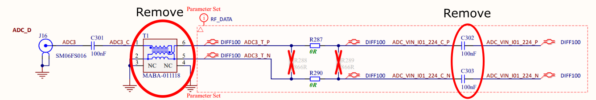
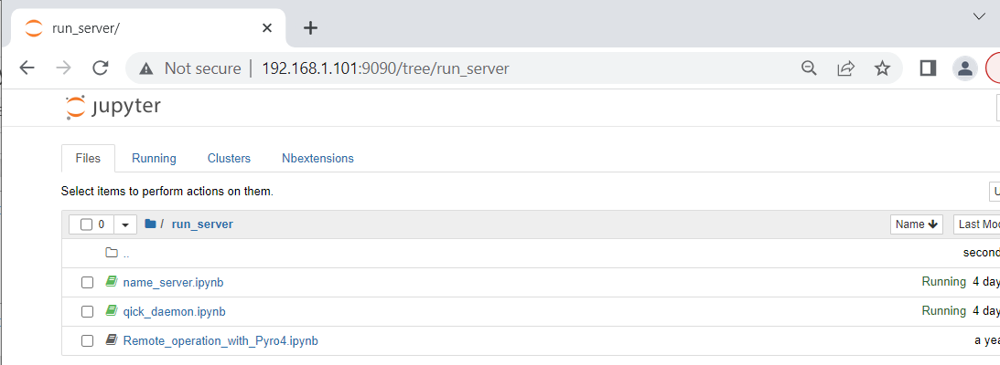

# RFSoC4x2 setup (WAN, direct internet connection)
This Readme supports setting up your RFSoC4x2, where the RFSoC4x2 is connected directly to the internet--Wide Area Network (WAN). We have an alternative Readme for labs where the RFSoC4x2 is not permitted to be directly connected to the internet.

The RFSoC4x2, as shown in the image below, is a board built and sold by [Real Digital](https://www.realdigital.org/) using AMD’s ZYNQ Ultrascale+ Gen 3 RFSoC ZU48DR chip.  While the ZU48DR has eight digital-to-analog converters (DACs) and analog-to-digital converters (ADCs), the RFSOC4x2 only uses four DACs (5 GSa/s) and two ADCs (9.85 GSa/s). Nonetheless, this number of inputs and outputs is nearly perfect for NV and quantum defect control. However, as the RFSOC4x2 is sold, the ADCs have a high frequency 1GHz high-pass balun inline which is typically too high frequency for our measurements and thus must be modified.

    

In this document we outline the setup for using QICK-DAWG with a RFSoC4x2. Specifically, we show how to:

1. Setup RFSoC4x2 Hardware 
    a. Remove the balun and bypass capacitors 
    b. Connect the low frequency differential amplifier 
    c. Connect PMOD digital outputs 
    d. Assemble and power on your RFSoC4x2  
    e. (Optional) Full enclosure

2. Setup lab control computer 
    a. Download/clone QICK-DAWG  
    b. Install necessary packages 

3. Install QICK-DAWG and other software to your RFSoC4x2  
    a. Flash your microSD card 
    b. Clone QICK-DAWG on your RFSoC4x2  
    c. Install necessary packages on your RFSOC4x2 
    d. Run the Pyro server to remotely connect to QICK and the RFSoC4x2 
    e. (Supplemental) Establish SSH Remote Connection with the RFSoC4x2 

# 1. Setup RFSoC4x2 Hardware 
## ***Prerequisites***

- [RFSoC4x2](https://www.xilinx.com/support/university/xup-boards/RFSoC4x2.html) (with 12 volt 50 watt power supply) 
- Low frequency differential amplifier [Texas Instruments LMH5401EVM](https://www.digikey.com/en/products/detail/texas-instruments/LMH5401EVM/5031896?s=N4IgTCBcDaIDIFkASBWALABgIwFEBqCIAugL5A)
- 3 x DC output voltage supply (+3.2, +0.7, -1.8V for biasing the differential amplifier)
- SMA cables
- Ethernet cord
- Micro SD card reader
### Software 
- [Win32DiskImager](https://sourceforge.net/projects/win32diskimager/) for Windows or Disk Manager on MacOS
- Dependent packages (follow `Installing Necessary Packages` section--included in the setup batch file)
    - [QICK](https://github.com/openquantumhardware/qick)
    - [Pyro4](https://pypi.org/project/Pyro4/)
    - [Serpent](https://pypi.org/project/serpent/) 

## 1a. Remove the balun and bypass capacitors

The ADCs on the RFSoC must be modified because the signal measured by the photodiodes cannot be directly connected to the ADCs on the board.
The ADCs on the RFSoC4x2 have baluns and capacitors that act as high pass filters. When using photodiodes for photoluminesence detection, the signal is low frequency, therefore unmodified ADCs do not let the signal from the photodiodes pass. Given this, the balun must be removed and the capacitors bypassed to readout the signal from the photodiodes with the ADCs. Furthermore, as the ADCs take in a differential voltage signal, we have to add a differential amplifier which takes the signal from the photodetector in and outputs a biased signal to the ADCs for digitization (see section 1.b below). 

The input electronics for one ADC channel on the RFSoC4x2 is shown in the figure below.  

<figure>
    

        
    

    <figcaption align="center">Circuit diagram for the RFSoC4x2 ADC D. (Left - Circled) Balun to be removed (Right - Circled) Solder input leads to the far side of the capacitors </figcaption>
</figure>

The combination of the balun (MABA-011118) and the two 100nF capacitors (C302 and C303) result in a high pass filter. In order to collect the signal, we need to remove the balun and bypass the capacitors. Our clumsy method is to pull off the balun (under an RF shield) and solder input wires on the down current side of the capacitors. 

    

## 1b. Connect the low frequency differential amplifier

To properly condition our signal for digitization, we use a Texas Instruments  [Texas Instruments LMH5401 EVM](https://www.digikey.com/en/products/detail/texas-instruments/LMH5401EVM/5031896?s=N4IgTCBcDaIDIFkASBWALABgIwFEBqCIAugL5A) evaluation board. This board takes in one or two signals and outputs two voltages above (Vp) and below (Vm) a common voltage (Vcm). For full scale, the RFSoC4x2 requires an offset voltage of Vcm = 0.7V (note that this is also true for the ZCU216 evaluation board, but the ZCU111 evaluation board requires Vcm = 1.2 V). Additionally, the differential amplifier requires two voltages for power, which are optimally set to (Vcm + 2.5) = 3.2V and (Vcm - 2.5 )= -1.8.  A labeled diagram of the LMH5401EVN is shown in the figure below.  

    

To connect the low frequency differential amplifier to the RFSoC4x2,

- solder a 3.3 V input wire to the red V+ post on the low frequency differential amplifier;
- solder a -1.8 V input wire to the yellow V- post on the low frequency differential amplifier;
- screw a 0.7 V SMA wire to the Vcm (V common) SMA head on the top of the low frequency differential amplifier;
- cut a semi-flexible SMA cable in half and strip the insulation off of both ends to expose the center conductor ;
- screw the SMA heads of the cut SMA cable to Vp and Vm SMA heads on the low frequency differential amplifier--screwing on the SMA cables now will limit the torsion on our delicate soldering in the next steps;
- take the SMA cables attached to the low frequency differential amplifier and solder them to the RFSoC4x2.
    - Vp should be soldered to the far side of the top capacitor
    - Vm should be soldered to the far side of the bottom capacitor

The image below is the circuit diagram for the RFSoC4x2 ADC modification.

         

RFSoC4x2 Schematic [1](#RFSoc4x2_Schematic)

Note if you are worried about removing the balun from your RFSoC4x2, marketplaces such as Digikey sell replacement baluns which can be used to restore the functionality of modified ADCs in the future. 

## 1c. Connect PMOD digial outputs
To control the laser with TTLs you must connect your laser to the PMOD located on the corner of the board. To connect, we cut the female head off a PMOD cable and soldered on a female BNC head instead. PMOD A 0-7 are enabled for QICK-DAWG (in the demo we use PMOD 0). The image below provides a schematic of the PMOD on the RFSoC4x2.

    

## 1d. Assemble and power on your RFSoC4x2 board

With the hardware modified and differential amplifier connected, the RFSoC4x2 can be assembled to be connected to your computer. This connection is made with a WAN connection and a router. To do so:
- slide your micro SD card into its slot on the RFSoC4x2 board and check that the BOOT switch is on SD mode; 
- connect an Ethernet cable from the board to the router;
- and connect the RFSoC4x2 to its power supply and turn it on.

You should hear the fan above the RFSoC chip begin to whir and you should see green LED lights blinking all over the board. After about 30 seconds the boot light should turn green and the LED screen will display the board's IP address. Your setup should resemble the schematic below. 

    

## 1e. (Optional) Full enclosure

In our lab, we have assembled all the necessary components into a custom rack box ([Bud Industries CH-14404 Enclosure](https://www.digikey.com/en/products/detail/bud-industries/CH-14404/428959)) with screw holes and 3D printed cages for fastening components. Hardware setup instructions for the enclosure can be found on our [QICK-DAWG Read the Docs](https://qick-dawg.readthedocs.io/en/latest/index.html) site. The following CAD files for the enclosure are found in `qickdawg/installation/enclosure`:

- Enclosure_Front.SLDPRT, CAD for custom enclosure front panel holes for SMA and BNC pass through
- Enclosure_Main.SLDPRT, CAD for custom enclosure drill holes to secure components
- Low_Freq_Diff_Amp_Base.SLDRT, CAD for 3D printable differential amplifier support for mounting the differential amplifier near the RFSoC 4x2 board
- Low-Freq_Diff_Amp_Top.SLDPRT, CAD for 3D printable differential amplifier top
- Router_Holder.SLDPRT, CAD for 3D printable router cage for holding the router in the enclosure

    

# 2. Setup lab control computer

## 2a. Download/clone QICK-DAWG
You need a local copy of QICK-DAWG on your lab control computer. There are two options for obtaining a local copy of QICK-DAWGm, 1) use a git manager to clone QICK-DAWG, found at `https://github.com/sandialabs/qick-dawg` or 2) download QICK-DAWG as a .zip file from the [GitHub repository](https://github.com/sandialabs/qick-dawg) and unzip it. 

## 2b. Install Necessary Packages
To run your RFSoC4x2 from your lab computer you need to install QICK-DAWG. To install QICK-DAWG, on your lab computer:

- Install Setuptools if not installed --> `pip install Setuptools`
- In the command prompt navigate to `*\qick-dawg`
- Enter `pip install -e ./`

This will install QICK-DAWG and it's dependent packages. 

# 3. Install QICK-DAWG and other software to your RFSoC4x2 

(Getting started directions adapted from [QICK ZCU111 quick-start-guide](https://github.com/openquantumhardware/qick/blob/main/quick_start/README_ZCU111.md))

## 3a. Flash your Micro SD Card ##
- First, you will need to flash the micro SD card with the **RFSoC4x2 PYNQ** image found [here](http://www.pynq.io/board.html). Download the RFSoC4x2 PYNQ image and unzip the file if it is a .zip file. 

(Windows)
- With your micro SD card plugged in to your computer, open Win32DiskImager. Select the PYNQ file as your image file and select your micro SD card as the device. Double check you are not flashing the image file to the wrong drive (**not your computer hard drive**)! To execute, click `Write`. 

    

## 3b. Clone QICK-DAWG on your RFSoC4x2 ##
We clone QICK-DAWG from the GitHub repository by establishing a ssh connect with the RFSoC4x2 and running a git clone command. To simplify the process we have a batch file that you can run `FPGA_SETUP_WAN.bat`.

To run this file
- open the command prompt in your computer
- change directories to `*\qick-dawg\installation`
- enter `FPFA_SETUP.bat`
- enter the IP address of your RFSoC4x2 when prompted

## 3c. Install necessary Packages on your RFSoC4x2 ##
With the required files copied to your RFSoC4x2, we will now install the required packages by running an .ipynb though the RFSoC4x2's Jupyter Notebook server. To connect to the jupyter notebook server:

- in a browser window type your RFSoC4x2 IP address as shown on the board's LED screen and use password `xilinx` as shown in the graphic below

    

 
From the home page, navigate to the installation folder, open Installation_Packages_WAN.ipynb and run all of the cells to install the packages. This should install QICK, Serpent, and Pyro4 to your python environment, which should be sufficient to run a Pyro server and remotely connect to your RFSoC4x2

## 3d. Run the Pyro server to remotely connect to QICK and the RFSoC4x2 ##

With all of the packages installed, you can now run your Pyro server to connect to an instance of QICK. This is accomplished by running two jupyter notebooks. 

- First we run `run_server/name_server.ipynb` which starts a Pyro server. In this notebook, you need to change the IP address to the IP address of your board. 

    

- Second, we run the `run_server/qick_daemon.ipynb` notebook, which uploads firmware to the RFSoC4x2 and creates a python socket to communicate with the board. This notebook has a string which contains the path to our alternative firmware and has a `ns_host` variable which needs to be assigned to the IP address of your RFSoC4x2 board. 

    

With these two notebooks running you can now start communicating with your RFSoC4x2 from a python kernel on your main computer. From here, we recommend running through `qickdawg/jupyter_notebooks/NVDemo_RFSoC4x2.ipynb` which contains significant documentation on how to run our basic NV characterization notebooks. 

## 3e. (Supplemental) Establish SSH Remote Connection with the RFSoC4x2 ##

You can also connect to your RFSoC4x2 through an Secure Shell (SSH) connection. To do so:
- open the command prompt on your lab computer;
- enter the following command `ssh xilinx@[insert IP address];
- and when prompted, enter the password `xilinx`.

# References
<a name="RFSoc4x2_Schematic">1</a>: [RFSoC4x2 Schematic](https://www.realdigital.org/downloads/3ae3a2552d7da46e9041196c654cd63d.pdf)

<a name="Serpent">2</a>: [Serpent Documentation](https://pypi.org/project/serpent/)

<a name="Pyro4">3</a>: [ Pyro4 Documentation](https://pyro4.readthedocs.io/en/stable/)

<a name="Qick">4</a>: [QICK Repository](https://github.com/openquantumhardware/qick)

