# RFSoC4x2, ZCU111 and ZCU216 setup (WAN, direct internet connection)
This Readme supports setting up your selected RFSoC FPGA, where it's connected directly to the internet--Wide Area Network (WAN). 

The RFSoC4x2, as shown in the image below, is a board built and sold by [Real Digital](https://www.realdigital.org/) using AMD’s ZYNQ Ultrascale+ Gen 3 RFSoC ZU48DR chip.  While the ZU48DR has eight digital-to-analog converters (DACs) and analog-to-digital converters (ADCs), the RFSOC4x2 only uses four DACs (5 GSa/s) and two ADCs (9.85 GSa/s). Nonetheless, this number of inputs and outputs is nearly perfect for NV and quantum defect control. 

<!-- However, as the RFSOC4x2 is sold, the ADCs have a high frequency 1GHz high-pass balun inline which is typically too high frequency for our measurements and thus must be modified. -->

<p align="center">
    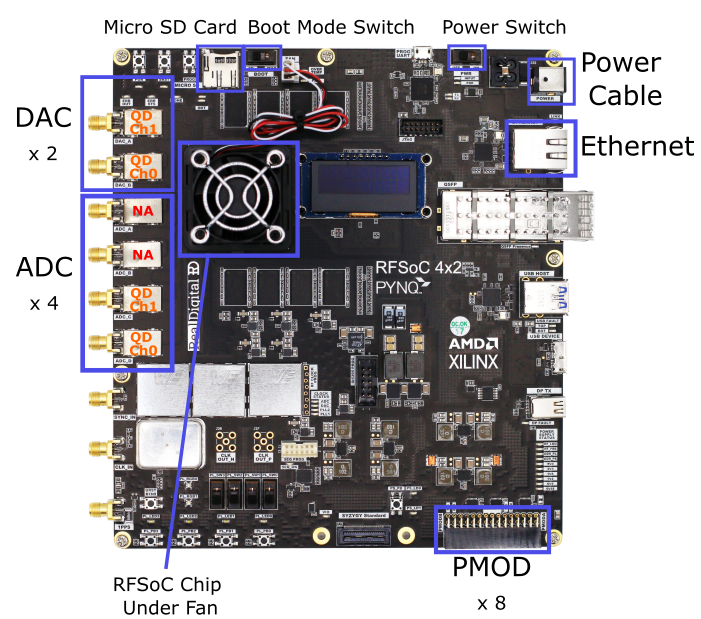

</p>

The ZCU216 and ZCU11 as shown in the images belows, are evaluation boards built by AMD using Zynq UltraScale+ RFSoC chips. The ZCU216 uses the on the ZU49DR chip, featuring 16 ADCs (2.5 GSa/s) and 16 DACs (9.85 GSa/s). The ZCU11 uses the ZU28DR chip, offering 8 ADCs (4.096 GSa/s) and 8 DACs (6.554 GSa/s).

<!-- However, as the RFSOC4x2 is sold, the ADCs have a high frequency 1GHz high-pass balun inline which is typically too high frequency for our measurements and thus must be modified. -->

<p align="center">
    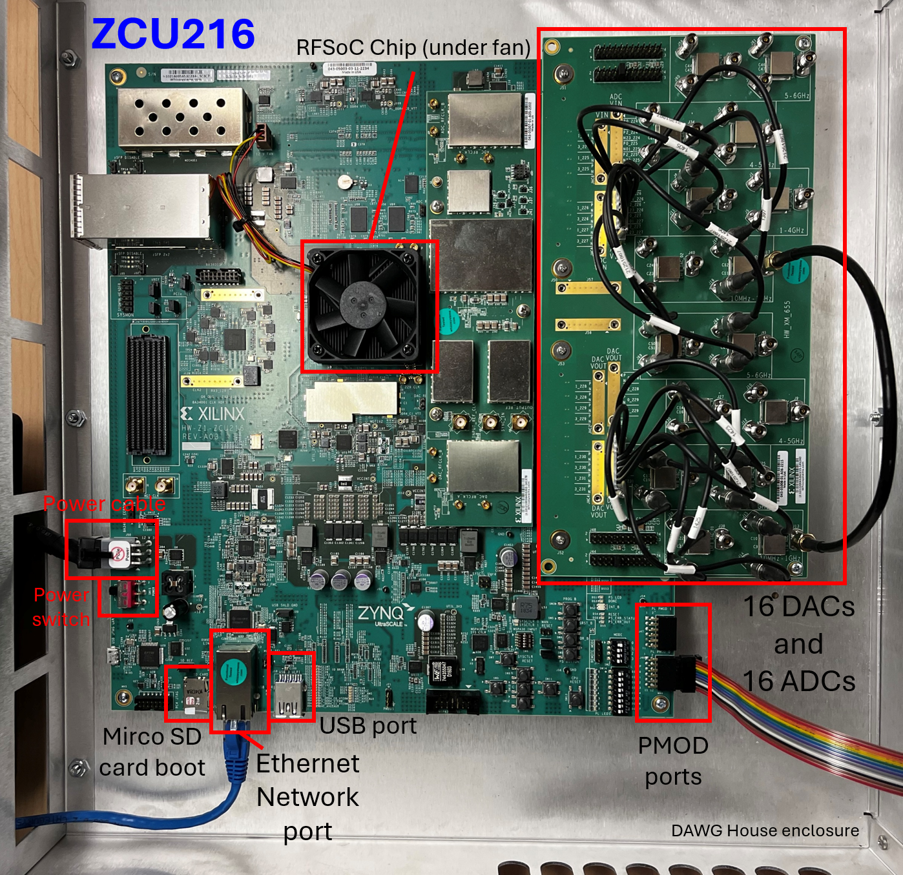

</p>

<p align="center">
    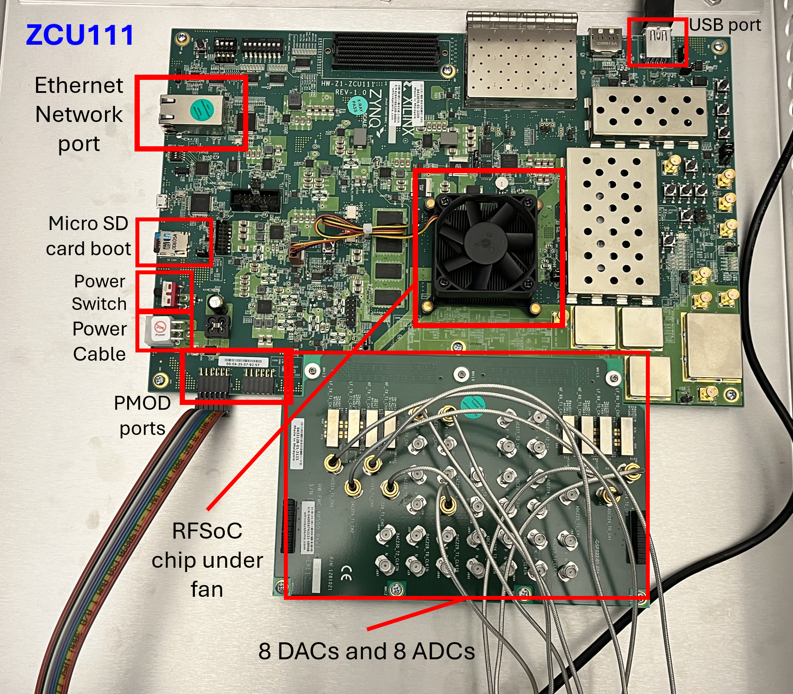

</p>
In this document we outline the setup for using QICK-DAWG with a RFSoC4x2, ZCU111 and ZCU216. Specifically, we show how to:

1. Install QICK-DAWG and other software to your RFSoC FPGA <br>
    a. Flash your microSD card<br>
    b. Clone QICK-DAWG on your RFSoC FPGA <br>
    c. Install necessary packages on your RFSoC FPGA <br>
    d. Run the Pyro server to remotely connect to QICK and the RFSoC FPGA<br>

2. Setup lab control computer<br>
    a. Download/clone QICK-DAWG <br>
    b. Install necessary packages<br>

3. Setup RFSoC FPGA Hardware<br>
    <!-- a. Photon counting mode<br> -->
    <!-- b. Low frequency analog modification<br> -->
    <!-- c. Connect PMOD digital outputs<br> -->
    a. Buffer board setup
    b. Assemble and power on your RF SoC FPGA <br>
    c. (Optional) Full enclosure assembly

## ***Prerequisites***
<!-- #### For initial setup: -->
<!-- - See xxxx build files for more details. -->
- [RFSoC4x2](https://www.xilinx.com/support/university/xup-boards/RFSoC4x2.html) (with 12 volt 50 watt power supply)
- [ZCU216](https://www.amd.com/en/products/adaptive-socs-and-fpgas/evaluation-boards/zcu216.html)
- [ZCU111](https://www.amd.com/en/products/adaptive-socs-and-fpgas/evaluation-boards/zcu111.html)
- Ethernet cord
- Micro SD card reader
<!-- (DC Mode) -->
<!-- - Low frequency differential amplifier [Texas Instruments LMH5401EVM](https://www.digikey.com/en/products/detail/texas-instruments/LMH5401EVM/5031896?s=N4IgTCBcDaIDIFkASBWALABgIwFEBqCIAugL5A) -->
<!-- - 3 x DC output voltage supply (+3.2, +0.7, -1.8V for biasing the differential amplifier) -->
- SMA cables

### Software 
- [Win32DiskImager](https://sourceforge.net/projects/win32diskimager/) for Windows or Disk Manager on MacOS
- Dependent packages (follow `Installing Necessary Packages` section--included in the setup batch file)
    - [QICK](https://github.com/openquantumhardware/qick)


# 1. Install QICK-DAWG and other software to your RFSoC FPGA 
<!-- This file no longer exists.. -->
<!-- (Getting started directions adapted from [QICK ZCU111 quick-start-guide](https://github.com/openquantumhardware/qick/blob/main/quick_start/README_ZCU111.md)) -->

## 1a. Flash your Micro SD Card ##
- First, you will need to flash the micro SD card with the appropiate PYNQ image file for your selected RFSoC FPGA. Download the RFSoC PYNQ image and unzip the file if it is a .zip file. Lastest and older versions are avaiable.
   - **RFSoC4x2 PYNQ** v3.1.1 image found [here](https://www.pynq.io/boards.html). 
   - **ZCU111** v3.1.1 image found [here](https://www.pynq.io/boards.html)
   - **ZCU216** found [here](https://github.com/sarafs1926/ZCU216-PYNQ)

(Windows)
- With your micro SD card plugged in to your computer, open Win32DiskImager. Select the PYNQ file as your image file and select your micro SD card as the device. Double check you are not flashing the image file to the wrong drive (**not your computer hard drive**)! To execute, click `Write`. 

<p align="center">
    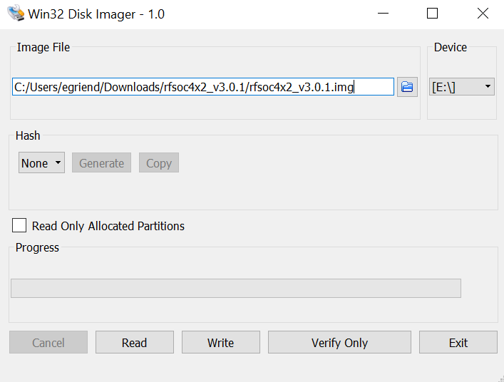
</p>

Once the image is written to the microSD card, put the microSD card into the RFSoC FPGA, connect to the internet via ethernet, and turn the board on. 
On the RFSoC4x2, the LED screen on top of the board will have your ip address which you will need for further steps. 

<!-- To setup your own static IP for the ZCU216 and ZC111:
- When connected to the board on the linux command line type: `*vim etc/networks/interfaces.d/eth0`
- For ethernet port `*eth0`, change `*iface eth0 inet dynamic` to `*iface eth0 inet dynamic`
- Save and exit
- Ensure on the Host machine the gateway IP on your selected ehternet port to the FPGA is static (i.e 192.168.0.1) and your ipv4 net is set static as well (i.e 192.168.0.xxx) -->

## 1b. Clone QICK-DAWG on your FPGA ##

SSH directly into the board using it's IP via windows cmd.exe with the command,

`ssh xilinx@{ip address}`

You will then be prompted for the password, which is also `xilinx` and asked to store the ssh footprint, for which you should respond `yes`. 
Now you'll have remote, terminal control of the board.  From here type

```
cd ./jupyter_notebooks
git clone https://github.com/sandialabs/qick-dawg

```
This will download the qick-dawg repository to the default directory of the jupyter notebook server run by the RFSoC FPGA.
If you cannot clone the qick-dawg repo from the board, clone it locally on your Host machine and copy it over the FPGA via scp, 

`scp qick-dawg/ xilinx@{ip address}:/jupyter_notebooks/`


## 1c. Install necessary Packages on your RFSoC FPGA ##
With the required files copied to your RFSoC FPGA, we will now install the required packages by running an .ipynb though the FPGA's Jupyter Notebook server. To connect to the jupyter notebook server:

In a browser window type your FPGA's IP address and use password `xilinx` as shown in the graphic below

<p align="center">
    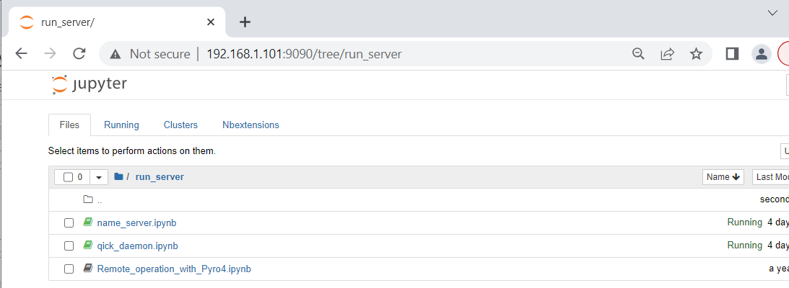
</p>
 
From the home page, navigate to the installation folder, open install_packages.ipynb and run all of the cells to install the packages. This does three things:

1. installs pyro4 for remote control of the board
2. downloads and installs qick
3. moves some files around


## 1d. Run the Pyro server to remotely connect to QICK and the RFSoC FPGA ##

With all of the packages installed, you can now run your Pyro server to connect to an instance of QICK. This is accomplished by running two jupyter notebooks. 

- First we run `run_server/name_server.ipynb` which starts a Pyro server. In this notebook, you need to change the IP address to the IP address of your board. 
<p align="center">
    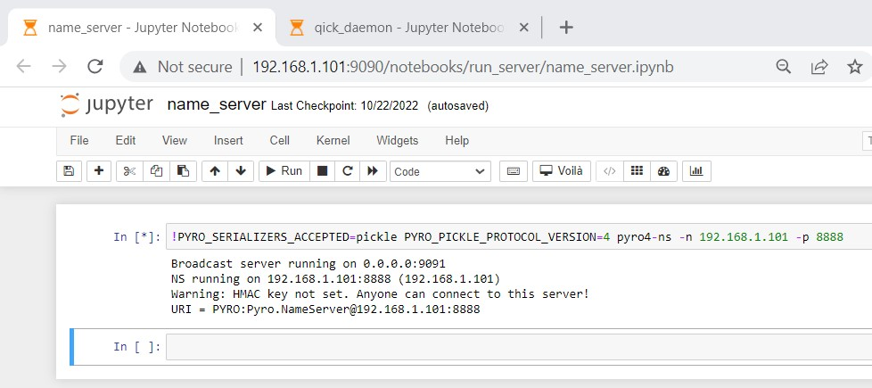
</p>


- Second, we run the `run_server/qick_daemon.ipynb` notebook, which uploads firmware to the FPGA and creates a python socket to communicate with the board. This notebook has a string which contains the path to our alternative firmware and has a `ns_host` variable which needs to be assigned to the IP address of your RFSoC4x2 board. 
<p align="center">
    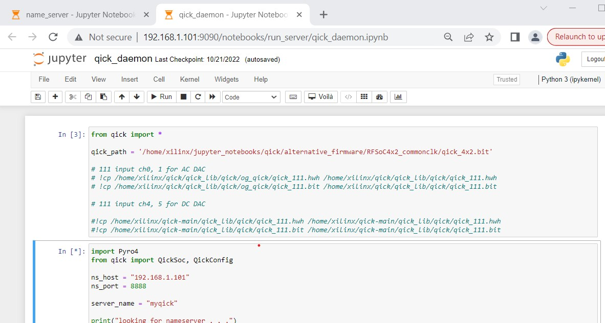
</p>

With these two notebooks running you can now start communicating with your FPGA from a python kernel on your Host computer. From here, we recommend running through `qickdawg/jupyter_notebooks/` which contains significant documentation on how to run our basic NV characterization notebooks. 

Note that the qick_daemon notebook specifically points to a firmware made for qick-dawg.

# 2. Setup lab control computer

## 2a. Download/clone a local copy QICK-DAWG
You need a local copy of QICK-DAWG on your lab control computer. There are two options for obtaining a local copy of QICK-DAWG

1.  use a git manager to clone QICK-DAWG, found at `https://github.com/sandialabs/qick-dawg` (on Windows, VSCode is nice for this)
2.  download QICK-DAWG as a .zip file from the [GitHub repository](https://github.com/sandialabs/qick-dawg) and unzip it. 

## 2b. Install Necessary Packages
To run your FPGA from your lab computer you need to install QICK-DAWG. To install QICK-DAWG, on your lab computer:

- In the command prompt navigate to `*\qick-dawg`
- Enter `pip install -e ./`

This will install QICK-DAWG and it's dependent packages. 

## Running demo notebooks

With the remote pyro4 server running on the FPGA and qick-dawg installed on your local computer you should now be able to connect to the demo notebooks in the /qick-dawg/jupyter_notebooks folder. 

# 3. Setup Your FPGA Hardware 
<!-- Is this section needed now? -->
## 3a. Photon counting mode

The ADC inputs on the RFSoC4x2 have baluns inline which act like long pass filters.  When we first made QICK-DAWG we had to bypass these for photodiode readout.  However, for single photon countings from a single photon detector module, the TTLs generate by each photon arrival can pass through the balun with sufficent signal to be counted.  Thus a single photon detector can be directly plugged into an ADC for counting mode as demo'd in coutning_demo_RFSoC4x2.ipynb.

<!-- To setup for this demo, plug your microwave amplifier into DAC_B and your single photon detector into ADC_D. Additionally, connect your laser gate into PMOD 0 (section 3c). -->

<!-- ## 3b. Low frequency analog readout

The ADCs on the RFSoC must be modified because ~1MHz signal measured by the photodiodes cannot be directly connected to the ADCs on the board.  The ADCs on the RFSoC4x2 have baluns and capacitors that act as high pass filters. When using photodiodes for photoluminesence detection, the signal is low frequency, therefore unmodified ADCs do not let the signal from the photodiodes pass. Given this, the balun must be removed and the capacitors bypassed to readout the signal from the photodiodes with the ADCs. Furthermore, as the ADCs take in a differential voltage signal, we have to add a differential amplifier which takes the signal from the photodetector in and outputs a biased signal to the ADCs for digitization (see section 1.b below). 

The input electronics for one ADC channel on the RFSoC4x2 is shown in the figure below.  

<figure>
    <p align="center">
        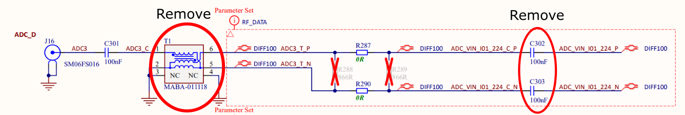
    </p>
    <!-- <figcaption align="center">Circuit diagram for the RFSoC4x2 ADC D. (Left - Circled) Balun to be removed (Right - Circled) Solder input leads to the far side of the capacitors </figcaption>
</figure> -->

<!-- The combination of the balun (MABA-801111) and the two 100nF capacitors (C302 and C303) result in a high pass filter. In order to collect the signal, we need to remove the balun and bypass the capacitors. Our clumsy method is to pull off the balun (under an RF shield) and solder input wires on the down current side of the capacitors. 


<p align="center">
    
</p> -->

<!-- ## Connect the low frequency differential amplifier -->


<!-- To properly condition our signal for digitization, we use a Texas Instruments  [Texas Instruments LMH5401 EVM](https://www.digikey.com/en/products/detail/texas-instruments/LMH5401EVM/5031896?s=N4IgTCBcDaIDIFkASBWALABgIwFEBqCIAugL5A) evaluation board. This board takes in one or two signals and outputs two voltages above (V<sub>p</sub>) and below (V<sub>m</sub>) a common voltage (V<sub>cm</sub>). For full scale, the RFSoC4x2 requires an offset voltage of V<sub>cm</sub> = 0.7V (note that this is also true for the ZCU216 evaluation board, but the ZCU111 evaluation board requires V<sub>cm</sub> = 1.2 V). Additionally, the differential amplifier requires two voltages for power, which are optimally set to (V<sub>cm</sub> + 2.5) = 3.2V and (V<sub>cm</sub> - 2.5 )= -1.8.  A labeled diagram of the LMH5401EVN is shown in the figure below.  

<p align="center">
    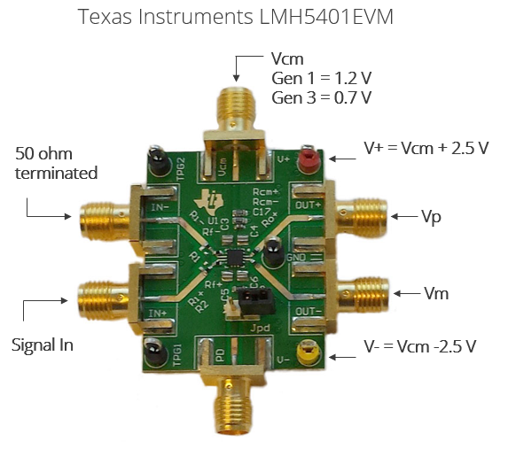
</p>

To connect the low frequency differential amplifier to the RFSoC4x2,

- solder a 3.3 V input wire to the red V+ post on the low frequency differential amplifier;
- solder a -1.8 V input wire to the yellow V- post on the low frequency differential amplifier;
- screw a 0.7 V SMA wire to the Vcm (V common) SMA head on the top of the low frequency differential amplifier;
- cut a semi-flexible SMA cable in half and strip the insulation off of both ends to expose the center conductor ;
- screw the SMA heads of the cut SMA cable to Vp and Vm SMA heads on the low frequency differential amplifier--screwing on the SMA cables now will limit the torsion on our delicate soldering in the next steps;
- take the SMA cables attached to the low frequency differential amplifier and solder them to the RFSoC4x2.
    - Vp should be soldered to the far side of the top capacitor
    - Vm should be soldered to the far side of the bottom capacitor

The image below is an image of the diff amp wired to the capacitors and the balun removed for a working RFSoC4x2 with DC inputs.

<p align="center">
    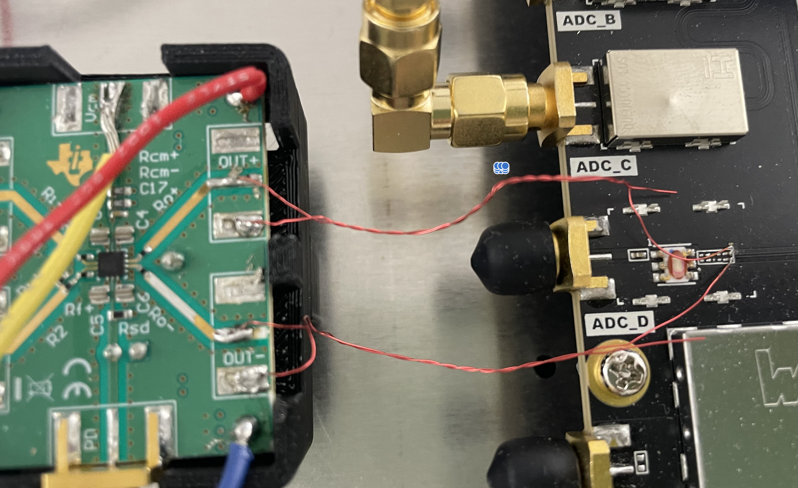     
</p>


RFSoC4x2 Schematic <sup>[1](#RFSoc4x2_Schematic)</sup>

Note if you are worried about removing the balun from your RFSoC4x2, marketplaces such as Digikey sell replacement baluns which can be used to restore the functionality of modified ADCs in the future. 
 -->
<!-- To connect, we cut the female head off a PMOD cable and soldered on a female BNC head instead. PMOD A 0-7 are enabled for QICK-DAWG (in the demo we use PMOD 0). The image below provides a schematic of the PMOD on the RFSoC4x2. -->

<p align="center">
    
</p>

## 3b. Assemble and power on your FPGA board

With the hardware setup and PMOD Buffer board connected, the FPGA can be assembled to be connected to your computer. This connection is made with a WAN connection and a router. To do so:
- slide your micro SD card into its slot on the FOGA board and check that the BOOT switch is on SD mode; 
- connect an Ethernet cable from the board to the router;
- and connect the FPGA to its power supply and turn it on.

You should hear the fan above the RFSoC chip begin to whir and you should see green LED lights blinking all over the board. On the 4x2, after about 30 seconds the boot light should turn green and the LED screen will display the board's IP address. Your setup should resemble the schematic below. 

### Wiring and Powering the Buffer Board
There are three wiring tasks for the enclosure: main power, the PMOD buffer board, and the final network connections. The PMOD TTL outputs are connected by first plugging in a 12-pin PMOD Header connector, which mates with one end of the 12 pin PMOD cable to the FPGA’s PL PMOD. Place the buffer board in the designated PMOD slot on the front panel of the enclosure labeled ”PMOD”. Ensure that the corresponding pin numbers on the buffer board align with those on the front label of the panel. The buffer board will be powered using a type A USB connector and the available USB 2.0 port on the FPGA. To allow power through the USB 2.0 port on the ZCU111 and ZCU216, the USB port must be enabled through jumper settings on the board to supply power to the buffer board. For the ZCU111, a jumper should be place on J17 GND and SHLD. For the ZCU216 at J19 HOST and J20 GND and SHLD. 

#### Final connections and setup
Finally, the Ethernet port of the RFSoC can be connected either directly to the host machine or to one channel of a router, with a second cable connecting another channel of the router to the Ethernet port of the FPGA. With all components assembled, the RFSoC firmware should be flashed to a microSD card as indicated in the installation section of https://github.com/sandialabs/qickdawg.

<!-- ???? -->
<!-- <p align="center">
    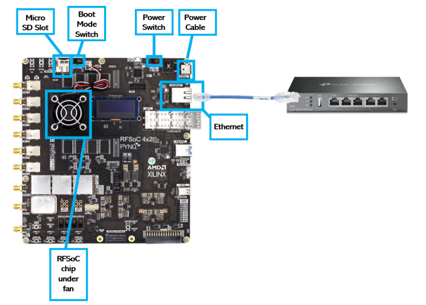
</p> --> -->

## 3c. (Optional) Full enclosure setup

In our lab, we have assembled all the necessary components into a custom rack box ([Bud Industries CH-14404 Enclosure](https://www.digikey.com/en/products/detail/bud-industries/CH-14404/428959)) with screw holes and 3D printed cages for fastening components. Hardware setup instructions for the enclosure can be found on our [QICK-DAWG Read the Docs](https://qick-dawg.readthedocs.io/en/latest/index.html) site. The following CAD files for the enclosure are found in `qickdawg/hardware/DAWG_House_{your FPGA}`:

- enclosure_Main.SLDPRT, CAD for custom enclosure drill holes to secure FPGA and front panel holes for SMA and buffer pass through.
- xxxx_front_graphics, graphics and labels for the front panel of the dawg house.

<!-- - Low_Freq_Diff_Amp_Base.SLDRT, CAD for 3D printable differential amplifier support for mounting the differential amplifier near the RFSoC 4x2 board
- Low-Freq_Diff_Amp_Top.SLDPRT, CAD for 3D printable differential amplifier top
- Router_Holder.SLDPRT, CAD for 3D printable router cage for holding the router in the enclosure -->

<!-- add another picture to replace this below. Older picture shows diff amp and DC mode on  -->
<!-- <p align="center">
    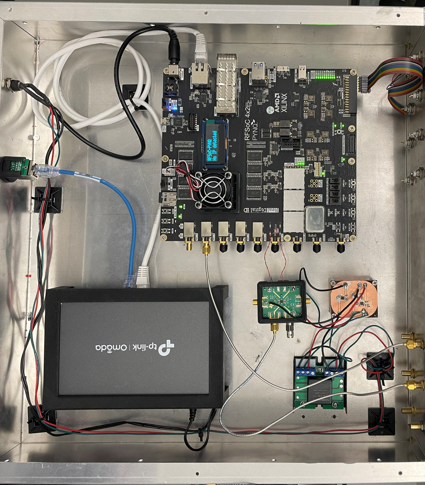
</p> -->

<!-- While this is listed as optional, for DC mode it is really required to sabilize the differential ampifier relative to the RFSoC4x2.  -->

# References
<a name="RFSoc4x2_Schematic">1</a>: [RFSoC4x2 Schematic](https://www.realdigital.org/downloads/3ae3a2552d7da46e9041196c654cd63d.pdf)

<a name="Qick">2</a>: [QICK Repository](https://github.com/openquantumhardware/qick)
